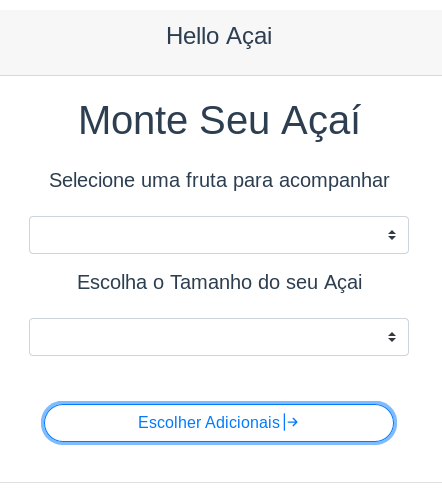
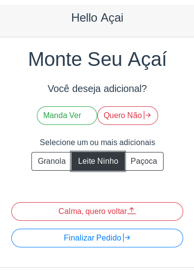
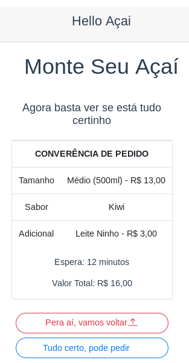

# Hello Açai  :sunglasses:

<p align="center">
     >>>  
     >>>
    
</p>

<br>

## Project setup
```
npm install
```

### Compiles and hot-reloads for development
```
npm run serve
```

### Install python dependencies
```
pipenv shell
```

### Run python server
```
python app.py
```

### Compiles and minifies for production
```
npm run build
```

### Lints and fixes files
```
npm run lint
```

### Customize configuration
See [Configuration Reference](https://cli.vuejs.org/config/).
